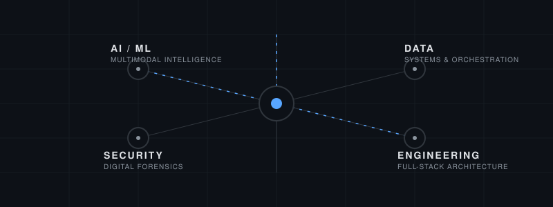

  

  <h1>Yashraj Kuyate</h1>
  
<b>Building at the intersection of AI, Data Science, and Digital Forensics.</b>

---

### Currently Building
Engineering multimodal intelligence models and secure infrastructure for forensic verification at [FiduScan](https://github.com/yashrajdnyaneshwarkuyate/FiduScan).

---

### Selected Systems

#### [FiduScan](https://github.com/yashrajdnyaneshwarkuyate/FiduScan)
**AI Forensic Detection System**
A modular AI forensic infrastructure designed to detect AI-generated and manipulated media. Combines EfficientNet and ViT with Grad-CAM for explainable probability mapping.

#### [CyberScope](https://github.com/yashrajdnyaneshwarkuyate/cyberscope)
**Supervisory Analytics Tool for SOC Assessment**
An offline, evidence-aware cybersecurity analysis system. Evaluates incomplete operational security evidence to reconstruct plausible attack paths without overclaiming. Built for SIH26157.

#### [Trace](https://github.com/yashrajdnyaneshwarkuyate/Carbon_Footprint)
**AI-Powered Environmental Intelligence**
A full-stack sustainability platform utilizing Google Gemini for automated footprint tracking via OCR and NLP. Engineered with Next.js, Supabase, and Prisma.

#### [Sonic Ride](https://github.com/yashrajdnyaneshwarkuyate/sonic-ride)
**Smart Bike Service Platform**
Scalable monorepo architecture orchestrating Next.js, Express, PostgreSQL, and Redis. Features dynamic geospatial discovery utilizing Haversine formulas.

---

### Research & Exploration
- **Multimodal Intelligence:** Transitioning from unimodal classification to generalized vision-language models.
- **Digital Forensics:** Enhancing SOC automation by reducing false positives in fragmented telemetry environments.
- **Systems Architecture:** Designing high-availability microservices using Docker, FastAPI, and Next.js App Router.

---

### Technical Areas

| Domain | Core Stack |
|--------|------------|
| **AI / ML** | PyTorch, TensorFlow, Gemini API, FastAPI |
| **Security** | Digital Forensics, JWT, Cryptographic Validation |
| **Data** | PostgreSQL, Prisma ORM, Redis, Supabase |
| **Engineering** | TypeScript, Next.js, Express, Docker |

---

  <a href="https://linkedin.com/in/yashrajkuyate">LinkedIn</a> • 
  <a href="mailto:your.email@example.com">Email</a> •
  <a href="https://yashrajkuyate.com">Portfolio</a>

