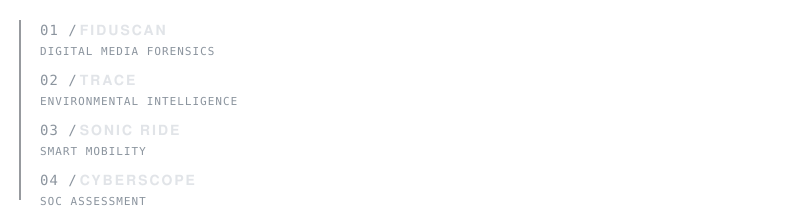

<br>

<div align="left">
  <h1>YASHRAJ KUYATE</h1>
  <p style="font-family: monospace; letter-spacing: 1px; color: #8b949e;">AI & DATA SCIENCE ENGINEER</p>
  <p>Engineering multimodal intelligence and secure forensic infrastructure.</p>
</div>

<br>
<br>

---

<br>

### 01 / FIDUSCAN
<p style="font-family: monospace; letter-spacing: 1px; color: #8b949e;">DIGITAL MEDIA FORENSICS</p>

```text
IMAGE ─┐
AUDIO ─┼──► FASTAPI INFERENCE ──► EFFICIENTNET / VIT ──► GRAD-CAM ANALYSIS
VIDEO ─┘
```
<p>Modular AI forensic infrastructure designed to detect AI-generated and manipulated media.</p>

<br>
<br>

---

<br>

### SELECTED SYSTEMS



<br>
<br>

---

<br>

### CURRENTLY EXPLORING

- Deep Learning
- Multimodal Intelligence
- Cybersecurity
- Agentic AI

<br>
<br>

---

<br>

### ENGINEERING LOG

<p style="font-family: monospace; line-height: 1.8;">
<b>2026</b><br>
<span style="color: #8b949e;">09 —</span> Re-architected engineering portfolio to rigorous editorial standard.<br>
<span style="color: #8b949e;">08 —</span> Deployed FiduScan infrastructure for multimodal digital forensics.<br>
<span style="color: #8b949e;">07 —</span> Built Trace MVP utilizing Gemini AI for environmental intelligence.<br>
<b>2025</b><br>
<span style="color: #8b949e;">11 —</span> Implemented CyberScope telemetry parser for SIH26157 SOC Assessment.
</p>

<br>
<br>

---

<br>

### CONTACT

<p style="font-family: monospace; letter-spacing: 1px;">
<a href="https://github.com/yashrajdnyaneshwarkuyate">GITHUB</a> &nbsp;•&nbsp; 
<a href="https://linkedin.com/in/yashrajkuyate">LINKEDIN</a> &nbsp;•&nbsp; 
<a href="https://yashrajkuyate.com">PORTFOLIO</a> &nbsp;•&nbsp; 
<a href="mailto:your.email@example.com">EMAIL</a>
</p>

<br>
